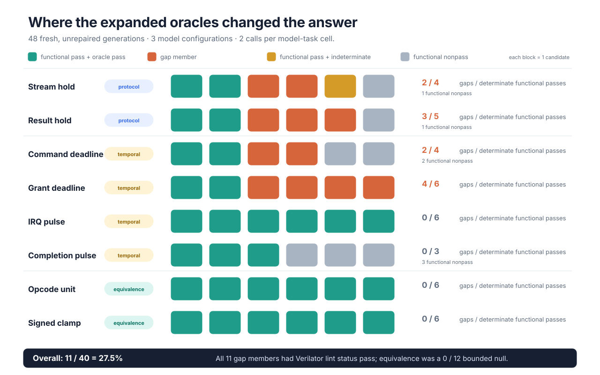
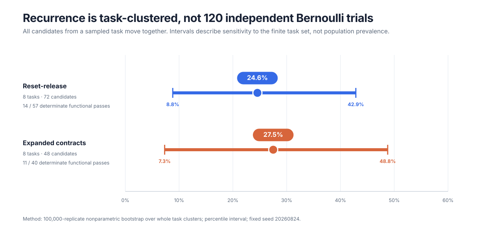

# Expanded contract-oracle generation study v0.1

Run date: 2026-08-24 Pacific time  
Taskpack freeze: `sha256:937bd8fe1297c89b279492700a25684fd4f5d37d510a27059cb9905b66981bff`

## Result

SV-Gap generated 48 fresh, unrepaired RTL candidates across eight task
clusters, three exact model configurations, and two calls per model-task cell.
The tasks exercise ready/valid persistence, bounded response, one-cycle pulse
width, and synthesized-reference equivalence. Each candidate was evaluated by
an Icarus functional smoke test, one contributing specialized oracle, and
contextual Verilator lint.

| Outcome | Count |
|---|---:|
| Planned and generated | 48 |
| Functional pass | 41 |
| Functional behavioral-test fail | 5 |
| Functional compile/elaboration error | 2 |
| Contributing-oracle pass | 32 |
| Contributing-oracle fail | 12 |
| Contributing-oracle tool error | 4 |
| Functional pass + determinate contributing oracle | 40 |
| Functional pass + contributing-oracle fail | 11 |

The configured specialized oracles changed the outcome for
**`11/40 = 27.5%`** of functionally accepted candidates with a determinate
specialized result. This is a taskpack-conditional automated detection
fraction, not an estimate of defects in generated RTL generally.



## Result by oracle class

| Class | Tasks | Candidates | Functional pass | Determinate functional pass | Gap members |
|---|---:|---:|---:|---:|---:|
| Protocol persistence | 2 | 12 | 10 | 9 | 5 |
| Temporal response and pulse | 4 | 24 | 19 | 19 | 6 |
| Synthesized-reference equivalence | 2 | 12 | 12 | 12 | 0 |
| **Total** | **8** | **48** | **41** | **40** | **11** |

The equivalence stratum is a bounded null result: all 12 candidates passed the
finite functional harness and the synthesized-reference miter. This does not
show that generated RTL is generally safe under synthesis semantics; it says
these two tasks and 12 outputs produced no detected divergence.

The protocol and temporal findings are directly inspectable counterexamples:

- `REF-PROT-001`: valid or payload did not persist through backpressure;
- `REF-TEMP-001`: a required response missed its bounded deadline; and
- `REF-TEMP-002`: a required one-cycle pulse had the wrong width.

## Result by task cluster

| Task | Class | Functional passes | Determinate functional passes | Gap members |
|---|---|---:|---:|---:|
| Stream hold | Protocol | 5 | 4 | 2 |
| Result hold | Protocol | 5 | 5 | 3 |
| Command deadline | Temporal | 4 | 4 | 2 |
| Grant deadline | Temporal | 6 | 6 | 4 |
| IRQ pulse | Temporal | 6 | 6 | 0 |
| Completion pulse | Temporal | 3 | 3 | 0 |
| Opcode unit | Equivalence | 6 | 6 | 0 |
| Signed clamp | Equivalence | 6 | 6 | 0 |

Detected cases recur in four of eight tasks and in both protocol and temporal
classes. The other four tasks are bounded zero rows, not evidence that their
contract class is solved.

## Task-clustered sensitivity analysis

Treating 48 calls as independent observations would overstate replication
because candidates share prompts, harnesses, and properties. A nonparametric
bootstrap resamples all candidates belonging to a task together.
With 100,000 replicates and seed `20260824`, the candidate-weighted estimate is
27.5% and the 95% percentile interval is **7.3% to 48.8%**.



This is a finite-task sensitivity interval. The eight tasks were hand-authored,
not randomly sampled from a defined population, so the interval must not be
reported as a population-prevalence confidence interval. The machine-readable
analysis is
[`reports/contract-oracles-v0.1-clustered.json`](https://github.com/shsridhar-beep/svgap/blob/main/reports/contract-oracles-v0.1-clustered.json).

## Ordinary lint result

All 11 gap members have Verilator lint status `pass`. Ten have no lint finding.
One has an unrelated unused-signal warning; it does not identify the protocol
violation. Therefore ordinary RTL lint identified **0/11** specialized failures
in this study.

This is an empirical result for the exact candidates and Verilator
configuration, not a general recall estimate for all linters. Lint still serves
important production purposes: style enforcement, suspicious construct and
width checks, portability checks, dead-code signals, and fast pre-simulation
feedback. It simply answers a different question from an explicit temporal or
equivalence obligation.

## Model configurations

| Configuration label | Provider interface | Candidates | Functional passes | Determinate passes | Gap members |
|---|---|---:|---:|---:|---:|
| `gpt-5.6-sol` | Codex CLI `0.145.0-alpha.2` | 16 | 16 | 16 | 0 |
| `qwen2.5-coder-7b` | Ollama `0.31.1` | 16 | 14 | 14 | 8 |
| `deepseek-coder-v2-16b` | Ollama `0.31.1` | 16 | 11 | 10 | 3 |

The Ollama calls used temperature `0.2`, non-streaming generation, and seeds
`2026082401` and `2026082402`. These per-configuration outcomes are descriptive
only. Two calls per task, unequal functional denominators, and eight
hand-authored tasks do not support a model ranking.

## Study controls and excluded pilot

- Task prompts, support files, manifests, safe/unsafe calibration references,
  and the canonical taskpack digest were frozen before the sequential primary
  run.
- Every safe and unsafe reference passed its finite functional harness; every
  safe reference passed its specialized oracle; every unsafe reference failed
  the intended stable rule.
- Candidates were generated in fresh calls and were not repaired.
- Claude CLI authentication was unavailable, so the frozen three-configuration
  design used one hosted configuration and two local open-weight configurations.
- An earlier interface pilot attempted to load the two Ollama models
  concurrently. It produced HTTP 500 generation failures and disrupted the
  hosted CLI network sandbox. The pilot was stopped and is excluded in full;
  no pilot candidate enters the 48 reported outputs.

The freeze is a local prospective freeze with a content digest. It was not
externally timestamped or preregistered, and there is not yet independent human
review of the 48 new candidates.

## Reproduction and public artifact

The public artifact contains all 48 candidate bundles: prompt, normalized RTL,
testbench, property or reference, manifest, report, generation metadata,
selected formal evidence, provenance hashes, a candidate outcome index, and
the clustered analysis. It is available under
[`artifacts/contract-oracle-study-v0.1/`](https://github.com/shsridhar-beep/svgap/tree/main/artifacts/contract-oracle-study-v0.1).

Verify every file hash, portable path, indexed outcome, report schema, and the
100,000-replicate analysis with:

```bash
.venv/bin/python scripts/verify_contract_oracle_artifacts.py
```

Replay an individual candidate with:

```bash
svgap check artifacts/contract-oracle-study-v0.1/candidates/<run>/<task>/manifest.toml
```

Rebuild the figures from the frozen JSON with:

```bash
.venv/bin/python scripts/build_research_figures.py
```

## Defensible claim

> In a locally frozen study of 48 fresh, unrepaired outputs over eight
> hand-authored protocol, temporal, and synthesis-equivalence tasks, 41 outputs
> passed the supplied finite smoke tests. Forty received a determinate
> contributing-oracle result, and 11 of those 40 failed the task's explicit
> protocol or temporal property. Verilator lint did not identify any of the 11
> specialized failures. Both equivalence tasks produced bounded null results.

Do not restate this as a 27.5% defect rate for a model population, a signoff
result, proof that ordinary lint never detects these classes, or evidence that
equivalence failures are rare. Broader task sampling, more calls, independent
expert adjudication, and industrial oracle replication remain necessary.
